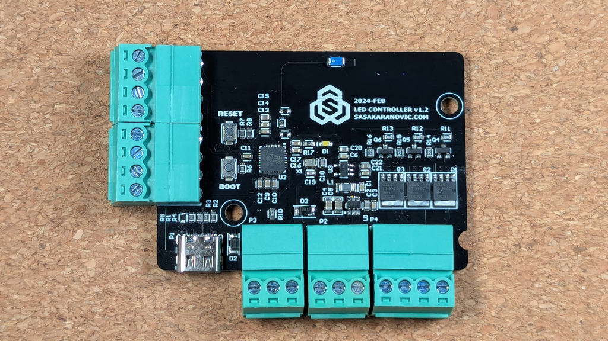
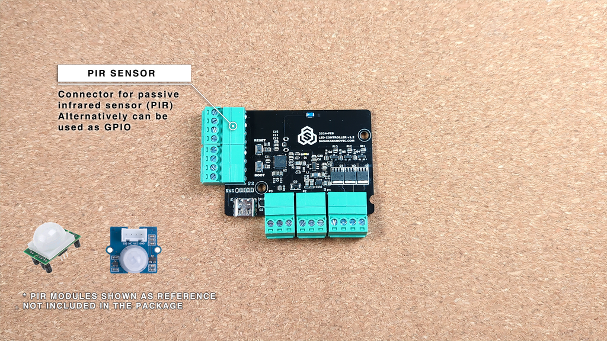
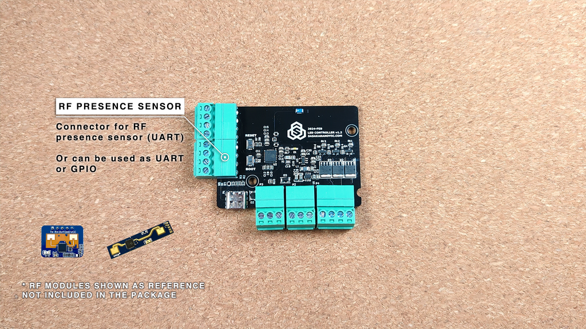
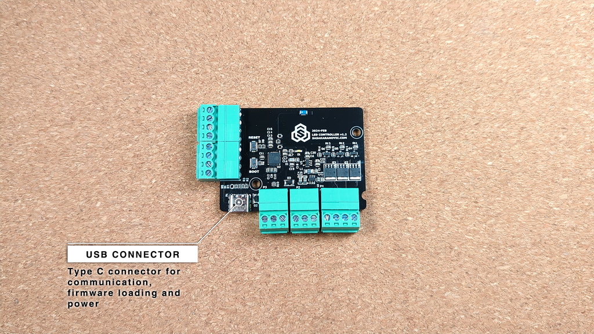
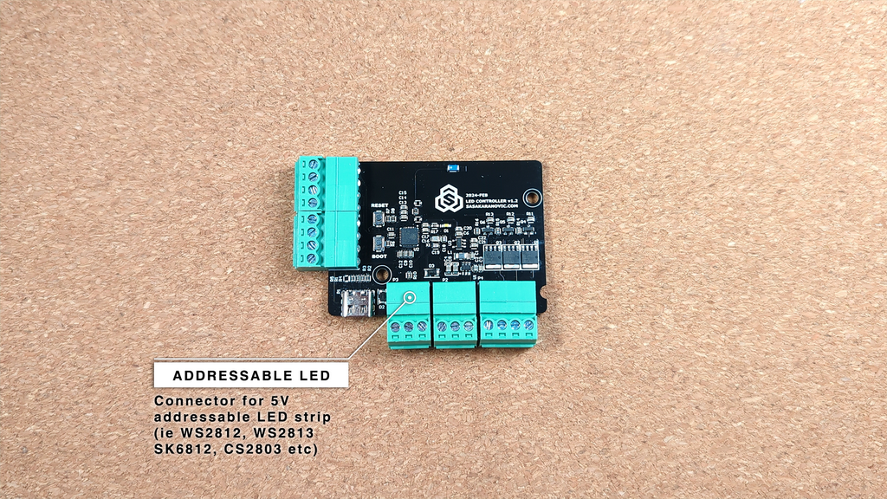
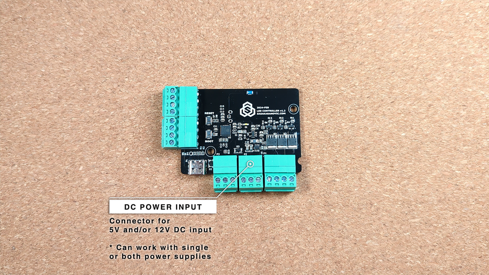
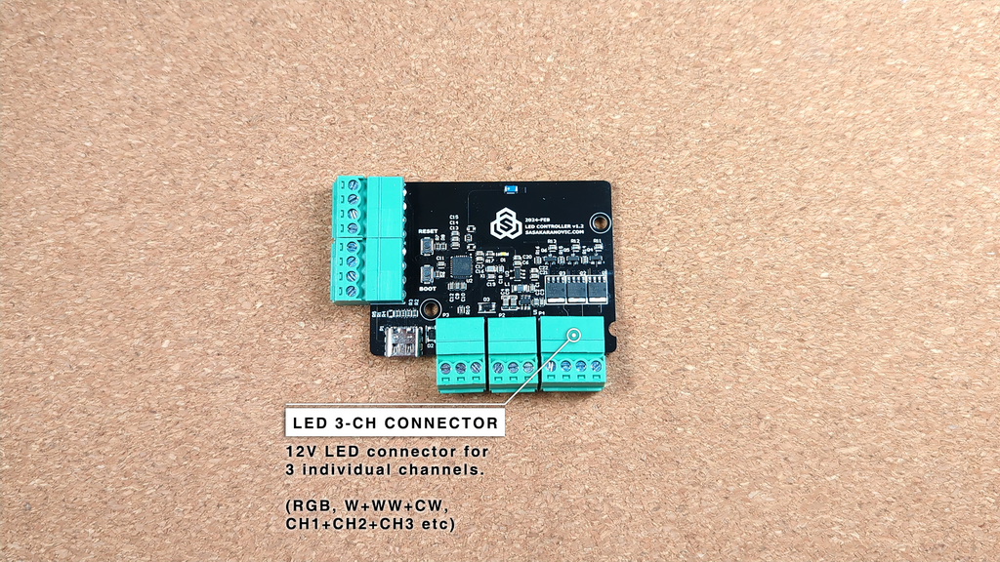
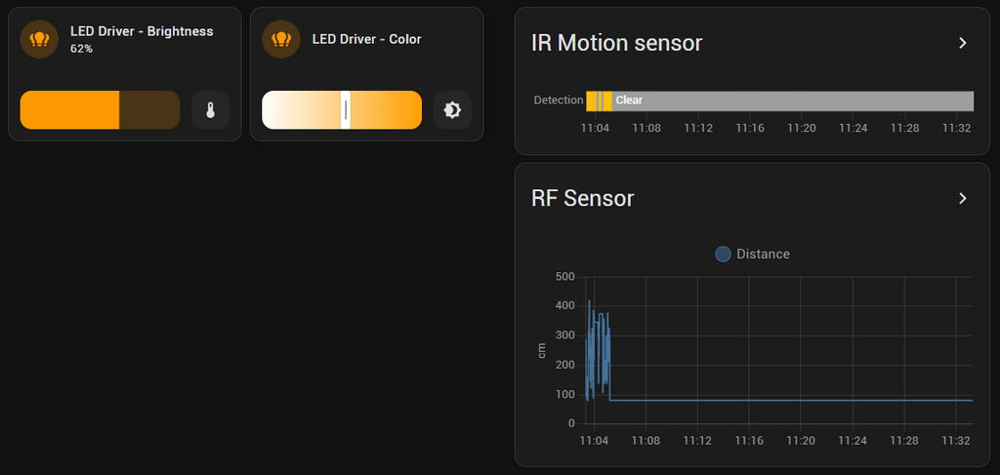

# OpenLED - Smart Home LED Controller

 

OpenLED controller is a DIY solution for creating LED fixtures for your smart home and home automation.

Easily control many different types of LED light strips (addressable, RGB, WW+CW etc) and integrate with your Home Assistant.

## Features

- Control 5V addressable LED strip
- Control 12V 3-CH LED strip (RGB, WW/CW etc)
- Wireless communication (WiFi connection)
- Support for IR sensor (PIR sensor)
- Support for RF / mmWave sensor (UART connection for RF sensor)
- Works with single and/or dual power supply (12V and/or 5V)
- Works with ESPHome
- Supports OTA (ESPHome) and/or USB firmware upgrade
- Open-Source and Open-Hardware
- DIY friendly

## Hardware

- ESP32-C3 microcontroller Wi-Fi and Bluetooth 5 (LE) SoC
- 3-channel 12V LED strip driver → Can be used for common anode strips; RGB LED strip, Cool-white + Warm-white LED strip etc.
- 5V Addressable LED strip → Support common 5V (3-pin) addressable LED strips (ie WS2812)
- Infra-Red (PIR) sensor → Passive IR sensor for presence/motion detection
- Connector for RF/mmWave sensor → High accuracy/sensitivity RF/mmWave sensor for precise presence/occupancy/movement detection
- USB connector → Data and power (firmware loading, powering 5V strip)
- 12V and 5V power supply → 12V for 3channel LED strip, 5V for addressable LED strip
- Integrated DC-DC voltage regulator to power 5V LED strip from 12V power supply (if 5V power supply is not connected)

Out of the box the board is pre-configured to work with HomeAssistant using ESPHome integration. This should allow anyone to get up-an-running in minutes.

## Can I buy OpenLED controller?

Yes you can. It's available on the [web shop](https://shop.sasakaranovic.com/products/openled).
  

## What platforms are supported?

OpenLED is designed to work with ESPHome to allow for quick and easy integration into your Smart Home system.

But it is also a very hacker friendly solution, so you could treat it as a custom board for which you can write your own Arduino/ESP code.

Or you can use any other ESP32 smart home integrations.

You could also use it as a ESP32 development board with all the above mentioned hardware features.

  

#### Sasa Karanovic

<a href="https://sasakaranovic.com/" target="_blank" title="Sasa Karanovic Home Page"> Home Page</a> &nbsp;&middot;&nbsp;
<a href="https://youtube.com/c/sasakaranovic" target="_blank" title="Sasa Karanovic on YouTube"> YouTube</a> &nbsp;&middot;&nbsp;
<a href="https://github.com/sasakaranovic" target="_blank" title="Sasa Karanovic on GitHub"> GitHub</a> &nbsp;&middot;&nbsp;
<a href="https://twitter.com/_sasakaranovic_" target="_blank" title="Sasa Karanovic on Twitter"> Twitter</a> &nbsp;&middot;&nbsp;
<a href="https://instagram.com/_sasakaranovic_" target="_blank" title="Sasa Karanovic on Instagram"> Instagram</a> &nbsp;&middot;&nbsp;
<a href="https://github.com/sponsors/SasaKaranovic" target="_blank" title="Sponsor on GitHub"> Sponsor on GitHub</a>
